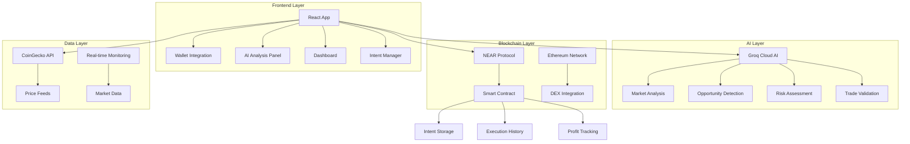
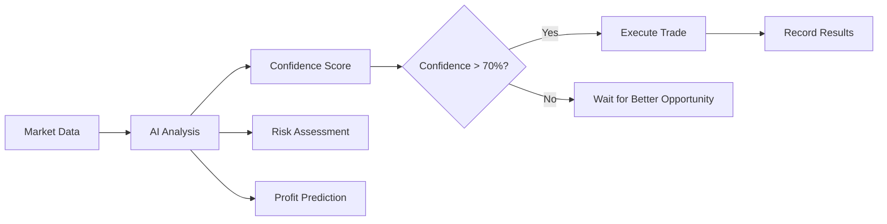

# 🚀 ArbitrageAI - Cross-Chain Arbitrage Agent

<div align="center">
  
  
  
  
  
  
</div>

## 🌟 Project Overview

**ArbitrageAI** is a revolutionary, production-ready AI-powered cross-chain arbitrage agent that automatically detects and executes profitable trading opportunities between NEAR Protocol and Ethereum networks. Built with cutting-edge technology and featuring a stunning space-themed UI, this application represents the future of decentralized finance automation.

### 🎯 What ArbitrageAI Does

ArbitrageAI is an intelligent trading system that:

1. **🤖 AI-Powered Market Analysis**: Uses Groq Cloud AI (Llama 3 8B model) to analyze market conditions every 30 seconds
2. **⚡ Automated Arbitrage Detection**: Continuously monitors price differences across NEAR and Ethereum DEXs
3. **🔗 Cross-Chain Execution**: Executes profitable trades automatically across multiple blockchain networks
4. **📊 Real-Time Analytics**: Provides comprehensive dashboards with live performance metrics
5. **🎨 Futuristic Interface**: Features a space-themed UI with smooth animations and responsive design
6. **🛡️ Secure Operations**: Implements robust security measures and smart contract validation

## 🏗️ System Architecture

### High-Level Architecture Diagram



### 🧠 Core Components Breakdown

#### 1. **Frontend Application (React + TypeScript)**
- **Dashboard**: Real-time performance analytics and market overview
- **Intent Manager**: Create and manage automated trading strategies
- **History Page**: Complete transaction history with detailed analytics
- **Settings Page**: Customize trading parameters and security settings
- **AI Analysis Panel**: Live AI market analysis and recommendations

#### 2. **AI Intelligence Engine (Groq Cloud)**
- **Market Analysis**: Real-time analysis of market conditions using Llama 3 8B model
- **Opportunity Detection**: AI identifies profitable arbitrage opportunities
- **Risk Assessment**: Evaluates gas fees, slippage, and market volatility
- **Predictive Analytics**: Price movement prediction and optimal timing
- **Trade Validation**: AI approves or rejects trades before execution
- **Continuous Learning**: Adapts to market conditions and improves over time

#### 3. **Smart Contract Layer (NEAR Protocol)**
- **Intent Management**: Stores user-defined trading strategies on-chain
- **Arbitrage Execution**: Handles trade execution and profit calculation
- **Cross-Chain Verification**: Validates signatures from other networks
- **Event Logging**: Records all transactions for audit trails
- **Security Controls**: Access control and permission management

#### 4. **Cross-Chain Integration**
- **NEAR DEX Integration**: Connects to NEAR-based decentralized exchanges
- **Ethereum DEX Support**: Interfaces with Ethereum DEX protocols
- **Bridge Protocols**: Secure cross-chain asset transfers
- **Signature Verification**: Multi-network transaction validation

## 🚀 Key Features Deep Dive

### 🧠 **Revolutionary AI Integration**

#### **Groq Cloud AI (Llama 3 8B Model)**
- **Real-time Analysis**: Market analysis every 30 seconds
- **Natural Language Processing**: Human-readable explanations for all decisions
- **Confidence Scoring**: Transparent confidence levels (0-100%) for all recommendations
- **Risk Assessment**: Multi-factor risk analysis including gas fees, slippage, volatility
- **Predictive Analytics**: Price movement predictions with confidence intervals
- **Adaptive Learning**: Continuously improves based on market patterns

#### **AI Analysis Features**
```typescript
// Example AI Analysis Output
{
  recommendation: "BUY",
  confidence: 87,
  reasoning: "Strong arbitrage opportunity detected with 2.3% profit potential. Low network congestion and optimal liquidity conditions.",
  riskLevel: "LOW",
  profitPotential: 23,
  timeframe: "immediate",
  marketSentiment: "BULLISH"
}
```

### 🎯 **Intelligent Arbitrage System**

#### **Intent-Based Trading**
Users create "intents" that define their trading strategies:
- **Token Pairs**: Choose from 8+ major cryptocurrency pairs
- **Profit Thresholds**: Set minimum profit percentages (0.1% - 50%)
- **Risk Parameters**: Configure maximum slippage and gas fees
- **AI Validation**: Each intent validated by AI before creation
- **Status Management**: Pause, resume, or modify intents anytime

#### **Automated Execution Pipeline**
1. **Market Monitoring**: Continuous price feed analysis
2. **AI Validation**: Opportunity assessment with confidence scoring
3. **Risk Evaluation**: Gas cost vs profit analysis
4. **Smart Contract Execution**: On-chain trade execution
5. **Result Logging**: Permanent record on NEAR blockchain

### 📊 **Real-Time Dashboard**

#### **Performance Metrics**
- **Total Profit**: Cumulative earnings from all trades
- **Active Intents**: Number of monitoring strategies
- **Success Rate**: Percentage of profitable trades
- **Live Opportunities**: AI-detected arbitrage chances

#### **AI Analysis Panel**
- **Market Analysis**: Overall market sentiment and recommendations
- **Opportunity Detection**: Real-time arbitrage opportunities
- **Risk Assessment**: Current market risk factors
- **Predictive Insights**: AI-powered market predictions

### 🔐 **Security & Safety**

#### **Smart Contract Security**
```rust
// Example security implementation
assert_eq!(intent.user, user, "Only intent owner can execute");
assert!(deposit >= 1_000_000_000_000_000_000_000_000, "Minimum 1 NEAR deposit required");
assert!(profit_percentage >= min_threshold, "Profit below threshold");
```

#### **AI Safety Measures**
- **Confidence Thresholds**: Only execute trades with >70% AI confidence
- **Risk Limits**: Automatic rejection of high-risk opportunities
- **Gas Optimization**: AI calculates optimal gas strategies
- **Slippage Protection**: Built-in slippage tolerance controls

## 🛠️ Technology Stack

### **Blockchain & Smart Contracts**
- **NEAR Protocol**: Primary blockchain for contract deployment
- **Rust**: Smart contract development language with memory safety
- **NEAR SDK**: Contract development framework with built-in features
- **NEAR API JS**: Frontend blockchain integration library
- **Cross-Chain Signatures**: Multi-network transaction support

### **AI & Machine Learning**
- **Groq Cloud**: High-performance AI inference platform
- **Llama 3 8B Model**: Advanced language model for market analysis
- **Real-time Processing**: Sub-second AI response times
- **Natural Language Generation**: Human-readable AI explanations

### **Frontend Development**
- **React 18**: Modern UI framework with concurrent features
- **TypeScript**: Type-safe development with enhanced IDE support
- **Vite**: Lightning-fast build tool and development server
- **Tailwind CSS**: Utility-first styling framework

### **UI/UX & Animations**
- **Framer Motion**: Smooth animations and micro-interactions
- **Lucide React**: Beautiful, consistent icon library
- **Responsive Design**: Mobile-first approach with breakpoints
- **Space Theme**: Futuristic design with animated backgrounds

### **Data & APIs**
- **TanStack Query**: Advanced data fetching and caching
- **CoinGecko API**: Real-time cryptocurrency price feeds
- **Axios**: HTTP client with request/response interceptors
- **WebSocket Support**: Real-time data streaming

### **Wallet Integration**
- **NEAR Wallet Selector**: Multi-wallet support (HERE, Meteor, MyNEAR)
- **Wallet Connection**: Seamless wallet integration
- **Transaction Signing**: Secure transaction authorization

## 📋 Project Structure

```
arbitrage-ai/
├── 📁 src/
│   ├── 📁 components/           # Reusable UI components
│   │   ├── 📁 ui/              # Base UI components (Button, Card, etc.)
│   │   ├── 📄 AIAnalysisPanel.tsx      # AI analysis and recommendations
│   │   ├── 📄 ContractStatus.tsx       # Smart contract connection status
│   │   ├── 📄 CreateIntentModal.tsx    # Intent creation interface
│   │   ├── 📄 Dashboard.tsx            # Performance analytics
│   │   ├── 📄 IntentManager.tsx        # Strategy management
│   │   ├── 📄 Navigation.tsx           # App navigation
│   │   ├── 📄 PriceChart.tsx           # Price visualization
│   │   ├── 📄 PriceMonitor.tsx         # Real-time price tracking
│   │   └── 📄 WalletConnection.tsx     # Wallet integration
│   ├── 📁 contexts/            # React contexts for state management
│   │   └── 📄 WalletContext.tsx        # Wallet state management
│   ├── 📁 hooks/               # Custom React hooks
│   │   ├── 📄 useGroqAI.ts             # AI integration hook
│   │   ├── 📄 useNear.ts               # NEAR contract integration
│   │   └── 📄 usePriceFeeds.ts         # Price data management
│   ├── 📁 pages/               # Application pages
│   │   ├── 📄 DashboardPage.tsx        # Main dashboard
│   │   ├── 📄 HistoryPage.tsx          # Transaction history
│   │   ├── 📄 LandingPage.tsx          # Welcome page
│   │   └── 📄 SettingsPage.tsx         # User settings
│   ├── 📁 utils/               # Utility functions
│   │   ├── 📄 groqAI.ts                # AI service integration
│   │   ├── 📄 nearContract.ts          # Smart contract interface
│   │   ├── 📄 near.ts                  # NEAR protocol utilities
│   │   └── 📄 priceFeeds.ts            # Price feed management
│   ├── 📄 App.tsx              # Main application component
│   └── 📄 main.tsx             # Application entry point
├── 📁 contract/                # NEAR smart contract
│   ├── 📄 src/lib.rs           # Main contract code
│   ├── 📄 Cargo.toml           # Rust dependencies
│   └── 📄 build.sh             # Contract build script
├── 📁 public/                  # Static assets
├── 📄 package.json             # Node.js dependencies
├── 📄 vite.config.ts           # Vite configuration
├── 📄 tailwind.config.js       # Tailwind CSS configuration
├── 📄 deploy.sh                # Deployment script
├── 📄 DEPLOYMENT.md            # Deployment guide
├── 📄 SECURITY.md              # Security guidelines
└── 📄 README.md                # This file
```

## 🚀 Quick Start Guide

### Prerequisites

Before you begin, ensure you have:

- **Node.js 18+** and npm installed
- **NEAR CLI** (`npm install -g near-cli`)
- **Git** for version control
- **NEAR Testnet Account** with testnet NEAR tokens
- **Groq API Key** (free at [console.groq.com](https://console.groq.com/))

### 1. Clone and Install

```bash
# Clone the repository
git clone <repository-url>
cd arbitrage-ai

# Install dependencies
npm install
```

### 2. Environment Setup

Create a `.env.local` file in the project root:

```env
# NEAR Protocol Configuration
VITE_NEAR_CONTRACT_ID=your-deployed-contract.testnet
VITE_NEAR_NETWORK_ID=testnet
VITE_NEAR_NODE_URL=https://rpc.testnet.near.org
VITE_NEAR_WALLET_URL=https://wallet.testnet.near.org
VITE_NEAR_HELPER_URL=https://helper.testnet.near.org
VITE_NEAR_EXPLORER_URL=https://explorer.testnet.near.org

# AI Configuration (Required for AI features)
VITE_GROQ_API_KEY=your-groq-api-key-here
```

**🔑 Getting a Groq API Key:**
1. Visit [Groq Cloud Console](https://console.groq.com/)
2. Sign up for a free account (no credit card required)
3. Navigate to API Keys section
4. Create a new API key
5. Copy the key to your `.env.local` file

**⚠️ Security Notes:**
- Never commit your `.env.local` file to version control
- Keep your API keys secure and rotate them regularly
- The `.env.local` file is already included in `.gitignore`

### 3. Deploy NEAR Contract (Optional)

```bash
# Make deployment script executable
chmod +x deploy.sh

# Run deployment (requires NEAR CLI setup)
./deploy.sh
```

**Note**: The app works in demo mode without a deployed contract, perfect for testing and development.

### 4. Start Development Server

```bash
npm run dev
```

Visit `http://localhost:5173` to see the application.

## 📖 How It Works

### 1. **User Journey**

#### **Step 1: Connect Wallet**
- Users connect their NEAR wallet (HERE, Meteor, or MyNEAR)
- Wallet integration handles authentication and transaction signing
- App automatically redirects to dashboard after connection

#### **Step 2: Create Trading Intent**
```typescript
// Example intent creation
const intent = {
  tokenPair: 'ETH/USDC',
  minProfitThreshold: '1.5', // 1.5% minimum profit
  status: 'active'
};
```

#### **Step 3: AI Validation**
- AI analyzes the intent parameters
- Provides confidence score and risk assessment
- Offers recommendations for optimization

#### **Step 4: Automated Monitoring**
- System monitors market conditions every 30 seconds
- AI continuously analyzes arbitrage opportunities
- Real-time updates displayed in dashboard

#### **Step 5: Trade Execution**
- When profitable opportunity detected:
  - AI validates the trade (>70% confidence required)
  - Smart contract executes the arbitrage
  - Results recorded on NEAR blockchain
  - User receives profit automatically

### 2. **AI Analysis Workflow**



### 3. **Smart Contract Operations**

#### **Intent Storage**
```rust
pub struct ArbitrageIntent {
    pub id: String,
    pub user: AccountId,
    pub token_pair: String,
    pub min_profit_threshold: f64,
    pub status: IntentStatus,
    pub created_at: U64,
}
```

#### **Execution Tracking**
```rust
pub struct ArbitrageExecution {
    pub id: String,
    pub intent_id: String,
    pub user: AccountId,
    pub token_pair: String,
    pub price_diff: f64,
    pub profit: f64,
    pub gas_fees: f64,
    pub tx_hash: String,
    pub timestamp: U64,
}
```

## 🎯 Features in Detail

### 🤖 **AI-Powered Analysis**

#### **Market Sentiment Analysis**
- Real-time analysis of market conditions and trends
- Sentiment scoring: BULLISH, BEARISH, or NEUTRAL
- Volatility index calculation (0-100 scale)
- Market momentum indicators

#### **Intelligent Risk Assessment**
- Multi-factor risk analysis including:
  - Gas fee impact on profitability
  - Market volatility and liquidity
  - Slippage tolerance calculations
  - Network congestion effects

#### **Predictive Analytics**
- Price movement predictions with confidence intervals
- Optimal timing recommendations for trade execution
- Market trend analysis and pattern recognition
- Adaptive learning from historical performance

### 📊 **Real-Time Dashboard**

#### **Performance Metrics**
- **Total Profit**: Cumulative earnings with percentage growth
- **Active Intents**: Number of monitoring strategies
- **Success Rate**: Percentage of profitable trades
- **Live Opportunities**: Current arbitrage chances

#### **AI Analysis Panel**
- **Market Analysis**: Overall market sentiment and recommendations
- **Opportunity Detection**: Real-time arbitrage opportunities with priority levels
- **Risk Factors**: Current market risks and mitigation strategies
- **Predictive Insights**: AI-powered market predictions

#### **Live Price Monitoring**
- Real-time price feeds from CoinGecko API
- Cross-chain price comparison
- Historical price charts with technical indicators
- Volume and liquidity analysis

### 🎯 **Intent Management System**

#### **Intent Creation**
- **Token Pair Selection**: Choose from 8+ major pairs (ETH/USDC, BTC/USDC, etc.)
- **Profit Thresholds**: Set minimum profit percentages (0.1% - 50%)
- **Risk Parameters**: Configure slippage tolerance and gas limits
- **AI Validation**: Pre-creation analysis and recommendations

#### **Intent Lifecycle**
1. **Creation**: User defines strategy parameters
2. **Validation**: AI analyzes and provides feedback
3. **Activation**: Intent stored on NEAR blockchain
4. **Monitoring**: Continuous market surveillance
5. **Execution**: Automated trade when conditions met
6. **Completion**: Results recorded and profits distributed

### 📈 **Transaction History**

#### **Comprehensive Tracking**
- **Execution Details**: Complete trade information
- **Profit Analysis**: Breakdown of gains and fees
- **Performance Metrics**: Success rates and trends
- **Blockchain Verification**: Links to NEAR Explorer
- **Export Capabilities**: Download data for analysis

#### **Advanced Filtering**
- Filter by token pair, date range, or profit amount
- Search by transaction hash or intent ID
- Sort by various metrics (profit, date, success rate)
- Export filtered results to CSV

### ⚙️ **Settings & Customization**

#### **Trading Preferences**
- **Auto-Trading**: Enable/disable automated execution
- **Risk Tolerance**: Set maximum acceptable risk levels
- **Gas Optimization**: Configure gas price strategies
- **Notification Settings**: Email, Telegram, or browser alerts

#### **Security Settings**
- **Transaction Confirmation**: Require manual approval for trades
- **Session Management**: Configure timeout periods
- **Access Control**: Manage wallet permissions
- **Audit Logging**: Track all account activities

## 🔐 Security & Safety

### **Smart Contract Security**

#### **Access Control**
```rust
// Only intent owner can modify
assert_eq!(intent.user, user, "Only intent owner can pause");

// Minimum deposit requirements
assert!(deposit >= 1_000_000_000_000_000_000_000_000, "Minimum 1 NEAR deposit required");

// Profit threshold validation
assert!(profit_percentage >= min_threshold, "Profit below threshold");
```

#### **Input Validation**
- All user inputs sanitized and validated
- Numeric ranges enforced (profit thresholds, gas limits)
- Token pair validation against supported list
- Deposit amount verification

#### **Gas Optimization**
```rust
const GAS_FOR_CROSS_CHAIN_CALL: Gas = Gas::from_tgas(100);
const GAS_FOR_DEX_SWAP: Gas = Gas::from_tgas(150);
```

### **AI Safety Measures**

#### **Confidence Thresholds**
- Only execute trades with >70% AI confidence
- Risk assessment for all opportunities
- Automatic rejection of high-risk trades
- Continuous monitoring of AI performance

#### **Risk Management**
- Maximum slippage protection (configurable)
- Gas fee impact analysis
- Market volatility assessment
- Liquidity depth verification

### **Frontend Security**

#### **Wallet Integration**
- Secure NEAR wallet connection protocols
- Transaction signing with user approval
- Private key never exposed to application
- Session management with automatic timeouts

#### **API Security**
- Rate limiting for external API calls
- Error handling with graceful degradation
- Input sanitization for all user data
- Secure environment variable management

## 🚀 Deployment Guide

### **Local Development**

```bash
# Install dependencies
npm install

# Start development server
npm run dev

# Build for production
npm run build

# Preview production build
npm run preview
```

### **NEAR Testnet Deployment**

#### **Prerequisites**
1. **Install NEAR CLI**:
   ```bash
   npm install -g near-cli
   ```

2. **Login to NEAR**:
   ```bash
   near login
   ```

3. **Fund Your Account**: Get testnet NEAR from [NEAR Faucet](https://near-faucet.io/)

#### **Deploy Contract**
```bash
# Run automated deployment
./deploy.sh
```

The script will:
- Create a new NEAR testnet account for the contract
- Deploy the smart contract
- Initialize the contract with your account as owner
- Update environment variables automatically
- Test contract functionality

#### **Manual Deployment**
```bash
# Create contract account
CONTRACT_NAME="arbitrage-ai-$(date +%s).testnet"
near create-account $CONTRACT_NAME --masterAccount your-account.testnet --initialBalance 10

# Build contract (if Rust is available)
cd contract
cargo build --target wasm32-unknown-unknown --release
cd ..

# Deploy contract
near deploy --contractName $CONTRACT_NAME --wasmFile contract/target/wasm32-unknown-unknown/release/arbitrage_contract.wasm

# Initialize contract
near call $CONTRACT_NAME new '{"owner": "your-account.testnet"}' --accountId $CONTRACT_NAME
```

### **Frontend Deployment**

#### **Vercel (Recommended)**
```bash
# Install Vercel CLI
npm install -g vercel

# Deploy to Vercel
vercel --prod
```

#### **Netlify**
```bash
# Build the project
npm run build

# Upload dist/ folder to Netlify
# Or connect GitHub repository for automatic deployments
```

#### **Environment Variables for Production**
```env
VITE_NEAR_CONTRACT_ID=your-deployed-contract.testnet
VITE_NEAR_NETWORK_ID=testnet
VITE_GROQ_API_KEY=your-production-groq-key
```

## 📱 Mobile Experience

The application is fully responsive and optimized for:

- **iOS Safari**: Native-like performance with smooth gestures
- **Android Chrome**: Optimized touch interactions and scrolling
- **Progressive Web App**: Installable on mobile devices
- **Offline Capabilities**: Core features work without internet
- **Mobile Wallet**: Seamless NEAR wallet integration on mobile

### **Mobile-Specific Features**
- Touch-optimized interface elements
- Swipe gestures for navigation
- Mobile-friendly modals and forms
- Responsive charts and visualizations
- Optimized loading states

## 🔧 Development

### **Available Scripts**

```bash
npm run dev          # Start development server with hot reload
npm run build        # Build for production with optimizations
npm run preview      # Preview production build locally
npm run lint         # Run ESLint for code quality
npm run type-check   # TypeScript type checking
```

### **Development Workflow**

1. **Setup Environment**:
   ```bash
   cp .env.example .env.local
   # Add your API keys and configuration
   ```

2. **Start Development**:
   ```bash
   npm run dev
   ```

3. **Code Quality**:
   ```bash
   npm run lint        # Check code quality
   npm run type-check  # Verify TypeScript types
   ```

4. **Testing**:
   ```bash
   npm test           # Run unit tests
   npm run test:e2e   # Run end-to-end tests
   ```

### **Code Organization**

#### **Component Structure**
```typescript
// Example component structure
interface ComponentProps {
  data: MarketData[];
  onAction: (action: string) => void;
}

export const Component: React.FC<ComponentProps> = ({ data, onAction }) => {
  // Component logic
  return (
    <motion.div
      initial={{ opacity: 0 }}
      animate={{ opacity: 1 }}
      className="component-styles"
    >
      {/* Component content */}
    </motion.div>
  );
};
```

#### **Hook Patterns**
```typescript
// Custom hook example
export const useCustomHook = () => {
  const [state, setState] = useState(initialState);
  
  const performAction = useCallback(async () => {
    // Action logic
  }, [dependencies]);
  
  return {
    state,
    performAction,
    // Other hook returns
  };
};
```

### **Environment Variables**

#### **Required Variables**
```env
VITE_GROQ_API_KEY=           # Groq AI API key (required for AI features)
```

#### **Optional Variables**
```env
VITE_NEAR_CONTRACT_ID=       # Deployed contract ID (demo mode if not provided)
VITE_NEAR_NETWORK_ID=        # testnet or mainnet (default: testnet)
VITE_NEAR_NODE_URL=          # NEAR RPC endpoint
VITE_NEAR_WALLET_URL=        # NEAR wallet URL
VITE_NEAR_HELPER_URL=        # NEAR helper service
VITE_NEAR_EXPLORER_URL=      # NEAR block explorer
```

## 🧪 Testing

### **Testing Strategy**

#### **Unit Tests**
- Component testing with React Testing Library
- Hook testing with custom test utilities
- Utility function testing with Jest
- Smart contract testing with NEAR SDK

#### **Integration Tests**
- API integration testing
- Wallet connection testing
- Smart contract interaction testing
- AI service integration testing

#### **End-to-End Tests**
- Complete user journey testing
- Cross-browser compatibility testing
- Mobile responsiveness testing
- Performance testing

### **Running Tests**

```bash
# Unit tests
npm test

# Integration tests
npm run test:integration

# E2E tests
npm run test:e2e

# Coverage report
npm run test:coverage
```

## 📈 Performance Optimization

### **Frontend Optimizations**

#### **Code Splitting**
- Lazy loading for optimal bundle sizes
- Route-based code splitting
- Component-level code splitting for large components

#### **Caching Strategy**
- AI response caching for 30 seconds
- Price data caching with smart invalidation
- Contract call result caching
- Image optimization with WebP format

#### **Bundle Optimization**
- Tree shaking for unused code elimination
- Dynamic imports for conditional features
- Webpack bundle analysis and optimization

### **AI Performance**

#### **Request Optimization**
- Batched AI requests for efficiency
- Request deduplication for similar queries
- Intelligent retry logic with exponential backoff
- Response caching with TTL

#### **Real-time Updates**
- WebSocket connections for live data
- Efficient state management with React Query
- Optimistic updates for better UX

### **Blockchain Optimizations**

#### **Gas Efficiency**
- Optimized smart contract methods
- Batch operations for multiple transactions
- Gas price optimization strategies

#### **State Management**
- Efficient on-chain storage patterns
- Minimal RPC calls with smart caching
- Query optimization for contract calls

## 🤝 Contributing

We welcome contributions! Here's how to get started:

### **Development Setup**

1. **Fork the Repository**
2. **Clone Your Fork**:
   ```bash
   git clone https://github.com/your-username/arbitrage-ai.git
   cd arbitrage-ai
   ```

3. **Create Feature Branch**:
   ```bash
   git checkout -b feature/your-feature-name
   ```

4. **Install Dependencies**:
   ```bash
   npm install
   ```

5. **Set Up Environment**:
   ```bash
   cp .env.example .env.local
   # Add your configuration
   ```

### **Development Guidelines**

#### **Code Standards**
- **TypeScript**: Use strict type checking
- **ESLint**: Follow configured linting rules
- **Prettier**: Use for consistent formatting
- **Conventional Commits**: Use conventional commit messages

#### **Component Guidelines**
- Use functional components with hooks
- Implement proper TypeScript interfaces
- Add comprehensive error handling
- Include loading and error states
- Write unit tests for complex logic

#### **Smart Contract Guidelines**
- Follow Rust best practices
- Implement comprehensive error handling
- Add proper access controls
- Write unit tests for all functions
- Document all public methods

### **Contribution Process**

1. **Make Your Changes**
2. **Add Tests**: Ensure new features have tests
3. **Run Quality Checks**:
   ```bash
   npm run lint
   npm run type-check
   npm test
   ```
4. **Commit Changes**:
   ```bash
   git commit -m "feat: add new feature"
   ```
5. **Push to Fork**:
   ```bash
   git push origin feature/your-feature-name
   ```
6. **Create Pull Request**

## 📄 License

This project is licensed under the MIT License - see the [LICENSE](LICENSE) file for details.

## 🙏 Acknowledgments

- **NEAR Protocol** for blockchain infrastructure and development tools
- **NEAR Foundation** for ecosystem support and documentation
- **Groq** for AI cloud computing and Llama 3 model access
- **CoinGecko** for reliable cryptocurrency price data APIs
- **Framer Motion** for smooth animations and micro-interactions
- **Tailwind CSS** for utility-first styling framework
- **React Community** for excellent tooling and ecosystem
- **Open Source Community** for inspiration and contributions

## 📞 Support & Community

### **Documentation**
- **Project Documentation**: This README and inline code comments
- **API Documentation**: Available in `/docs` folder
- **Smart Contract Docs**: Rust documentation in contract source

### **Community**
- **GitHub Issues**: Report bugs and request features
- **GitHub Discussions**: Community discussions and Q&A
- **Discord**: Real-time community chat (coming soon)
- **Twitter**: Follow [@ArbitrageAI](https://twitter.com/arbitrageai) for updates

### **Support Channels**
- **Email**: support@arbitrageai.com
- **GitHub Issues**: Technical support and bug reports
- **NEAR Support**: [NEAR Discord](https://discord.gg/near) for NEAR-specific issues

### **Getting Help**

1. **Check Documentation**: Start with this README and inline comments
2. **Search Issues**: Look for existing solutions in GitHub issues
3. **Create Issue**: If you can't find a solution, create a detailed issue
4. **Community Discussion**: Use GitHub Discussions for general questions

---

<div align="center">
  <p><strong>Built with ❤️ for the future of DeFi</strong></p>
  <p>🚀 Powered by NEAR Protocol & Groq AI</p>
  <p>⭐ Star this repo if you found it helpful!</p>
  
  <br>
  
  
  
  
</div>