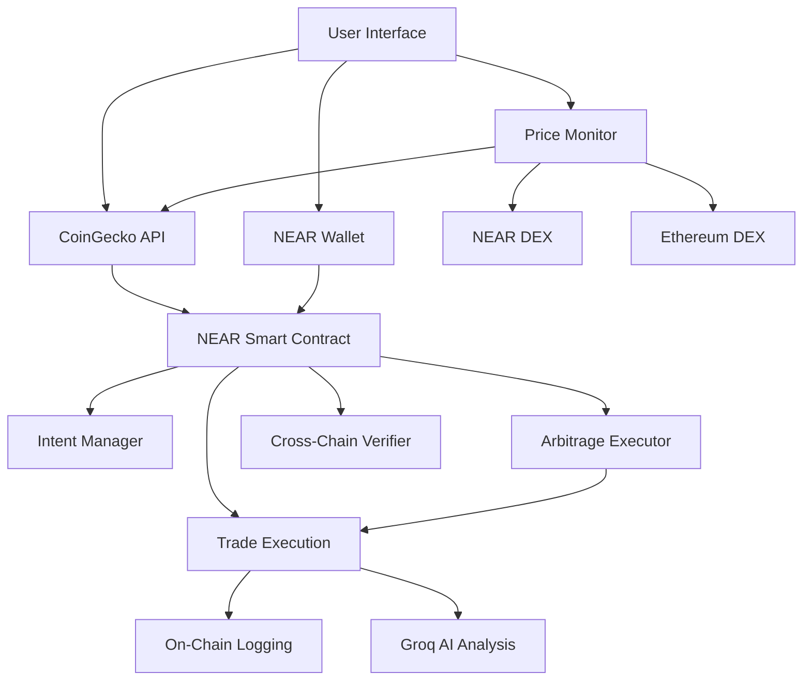

# 🚀 ArbitrageAI - Cross-Chain Arbitrage Agent

<div align="center">
  
  
  
  
  
</div>

## 🌟 Overview

**ArbitrageAI** is a production-ready, AI-powered cross-chain arbitrage agent that automatically detects and executes profitable trading opportunities between NEAR Protocol and Ethereum networks. Built with a stunning space-themed UI and powered by real-time price feeds, this application represents the future of decentralized finance automation.

### 🎯 What This Project Does

1. **🤖 AI-Powered Detection**: Continuously monitors price differences across NEAR and Ethereum DEXs using advanced algorithms
2. **⚡ Automated Execution**: Executes profitable trades automatically when opportunities exceed user-defined thresholds
3. **🔗 Cross-Chain Integration**: Seamlessly operates across multiple blockchain networks with secure signature verification
4. **📊 Real-Time Analytics**: Provides comprehensive dashboards with live performance metrics and trade history
5. **🎨 Futuristic UI**: Features a space-themed interface with smooth animations and responsive design

## 🏗️ Architecture Overview



### 🧠 Core Components

#### 1. **Smart Contract Layer (NEAR Protocol)**
- **Intent Manager**: Stores user-defined trading strategies on-chain
- **Arbitrage Executor**: Handles trade execution and profit calculation
- **Cross-Chain Verifier**: Validates signatures from other networks
- **Event Logger**: Records all transactions for audit trails
- **AI Integration**: Validates trades with Groq AI before execution

#### 2. **AI Detection Engine**
- **Groq Cloud AI Integration**: Powered by Llama 3 8B model for advanced market analysis
- **Real-time Market Analysis**: AI analyzes price patterns, volume, and market sentiment
- **Intelligent Opportunity Detection**: Machine learning identifies profitable arbitrage opportunities
- **Risk Assessment**: AI evaluates gas fees, slippage, and market volatility before execution
- **Predictive Analytics**: Price movement prediction and optimal timing recommendations
- **Adaptive Learning**: Continuously improves recommendations based on market conditions
- **Smart Contract Validation**: AI approves or rejects trades before on-chain execution

#### 3. **Frontend Application**
- **Dashboard**: Real-time performance analytics and active intents
- **Intent Manager**: Create and manage automated trading strategies
- **History**: Complete transaction history with detailed analytics
- **Settings**: Customize trading parameters and notifications
- **Contract Status**: Live smart contract connection and health monitoring

## 🚀 Quick Start

### Prerequisites

- Node.js 18+ and npm
- NEAR CLI (`npm install -g near-cli`)
- Git
- NEAR Testnet Account with some testnet NEAR tokens

### 1. Clone and Install

```bash
git clone <repository-url>
cd cross-chain-arbitrage-agent
npm install
```

### 2. Environment Setup

Create a `.env.local` file in the project root:

```env
# NEAR Protocol Configuration
VITE_NEAR_CONTRACT_ID=arbitrage-ai.testnet
VITE_NEAR_NETWORK_ID=testnet
VITE_NEAR_NODE_URL=https://rpc.testnet.near.org
VITE_NEAR_WALLET_URL=https://wallet.testnet.near.org
VITE_NEAR_HELPER_URL=https://helper.testnet.near.org
VITE_NEAR_EXPLORER_URL=https://explorer.testnet.near.org

# AI Configuration (Required for AI features)
VITE_GROQ_API_KEY=your-groq-api-key
```

**Important Security Notes:**
- Never commit your `.env.local` file to version control
- Keep your API keys secure and rotate them regularly
- Use different API keys for development and production
- The `.env.local` file is already included in `.gitignore`

**Getting a Groq API Key:**
1. Visit [Groq Cloud Console](https://console.groq.com/)
2. Sign up for a free account
3. Navigate to API Keys section
4. Create a new API key
5. Copy the key to your `.env.local` file
### 3. Deploy NEAR Contract

```bash
# Make deployment script executable
chmod +x deploy.sh

# Run deployment
./deploy.sh
```

The script will:
- Create a new NEAR testnet account
- Deploy the smart contract
- Initialize the contract with your account
- Update environment variables automatically
- Test contract functionality

### 4. Start Development Server

```bash
npm run dev
```

Visit `http://localhost:5173` to see the application.

## 📋 How It Works

### 1. **Intent Creation**
Users define their trading strategies by:
- Selecting token pairs (ETH/USDC, BTC/USDC, etc.)
- Setting minimum profit thresholds
- Configuring risk parameters
- Getting AI validation before submission
- Submitting intents to the NEAR smart contract

### 2. **Price Monitoring**
The system continuously:
- Fetches real-time prices from CoinGecko API
- Analyzes market data using Groq Cloud AI (Llama 3 8B model)
- Detects cross-chain price discrepancies with AI validation
- Provides intelligent recommendations with confidence scores
- Predicts price movements and optimal execution timing
- Validates opportunities against user intents on-chain

### 3. **Arbitrage Execution**
When opportunities are detected:
- Groq AI analyzes the opportunity with advanced algorithms
- Validates profit potential, risk factors, and market conditions
- Provides detailed reasoning and confidence scores
- Smart contract verifies user permissions and intent parameters
- Cross-chain signatures are generated and verified
- Trades are executed only with AI approval and high confidence
- All results are permanently recorded on NEAR blockchain
- Results are logged on-chain for transparency

### 4. **Profit Tracking**
All activities are recorded:
- On-chain storage of all trade data
- Trade execution details
- Profit/loss calculations
- Gas fee tracking
- Performance analytics
- Immutable audit trail on NEAR blockchain

## 🛠️ Technology Stack

### **Blockchain & Smart Contracts**
- **NEAR Protocol**: Primary blockchain for contract deployment
- **Rust**: Smart contract development language
- **NEAR SDK**: Contract development framework
- **NEAR API JS**: Frontend blockchain integration
- **Cross-Chain Signatures**: Multi-network transaction support

### **Frontend Development**
- **React 18**: Modern UI framework
- **TypeScript**: Type-safe development
- **Vite**: Fast build tool and dev server
- **Tailwind CSS**: Utility-first styling

### **UI/UX & Animations**
- **Framer Motion**: Smooth animations and transitions
- **Lucide React**: Beautiful icon library
- **Responsive Design**: Mobile-first approach

### **Data & APIs**
- **TanStack Query**: Data fetching and caching
- **CoinGecko API**: Real-time cryptocurrency prices
- **Groq Cloud AI**: Advanced market analysis and predictions
- **Llama 3 8B Model**: Natural language processing for market insights
- **Axios**: HTTP client for API requests

### **Wallet Integration**
- **NEAR Wallet Selector**: Seamless wallet connection
- **NEAR API JS**: Direct contract interaction
- **Cross-Chain Signatures**: Multi-network transaction support

## 📊 Features Deep Dive

### 🧠 **AI-Powered Analysis**
Revolutionary AI integration with:
- **Market Sentiment Analysis**: Real-time analysis of market conditions and trends
- **Intelligent Risk Assessment**: AI evaluates multiple risk factors before trade execution
- **Predictive Analytics**: Price movement predictions with confidence intervals
- **Adaptive Recommendations**: Learning from market patterns and user preferences
- **Natural Language Insights**: Human-readable explanations for all AI decisions
- **Confidence Scoring**: Transparent confidence levels for all AI recommendations
- **Smart Contract Integration**: AI validates trades before on-chain execution

### 🎯 **Arbitrage Intents**
Create sophisticated trading strategies with:
- **Token Pair Selection**: Choose from major cryptocurrency pairs
- **Profit Thresholds**: Set minimum profit percentages (0.5% - 50%)
- **Risk Management**: Configure maximum slippage and gas fees
- **Status Management**: Pause, resume, or modify intents anytime
- **On-Chain Storage**: All intents stored permanently on NEAR blockchain
- **AI Validation**: Each intent validated by AI before creation

### 📈 **Real-Time Dashboard**
Monitor your performance with:
- **Contract Status**: Live connection status and contract health
- **AI Analysis Panel**: Comprehensive market analysis with AI insights
- **AI-Detected Opportunities**: Machine learning identified arbitrage chances
- **Predictive Indicators**: AI-powered price movement predictions

### 🔍 **Trade History**
Complete transparency with:
- **Blockchain Verification**: All data verified on NEAR blockchain
- **Detailed Transaction Logs**: Every trade recorded on-chain
- **Profit Analysis**: Breakdown of gains and fees
- **Block Explorer Links**: Verify transactions independently
- **Export Capabilities**: Download data for tax reporting
- **Immutable Records**: Permanent audit trail on blockchain

### ⚙️ **Advanced Settings**
Customize your experience:
- **Notification Preferences**: Email, Telegram, or browser alerts
- **Trading Parameters**: Auto-trading toggles and limits
- **Security Settings**: Session timeouts and confirmations
- **Data Management**: Clear history and reset preferences
- **Contract Management**: View and manage smart contract interactions

## 🔐 Security Features

### **On-Chain Security**
- **Smart Contract Validation**: All operations validated by NEAR smart contract
- **Signature Verification**: All cross-chain transactions verified
- **AI Validation**: Additional security layer through AI risk assessment
- **Access Control**: Users can only modify their own intents
- **Immutable Audit Trail**: Complete transaction history on blockchain
- **Audit Trail**: Complete transaction history on blockchain
- **Gas Optimization**: Efficient contract design minimizes fees
- **Smart Execution**: AI prevents execution of high-risk trades
- **Permission System**: Granular permissions for contract interactions

### **Frontend Security**
- **Wallet Integration**: Secure NEAR wallet connection
- **Contract Interface**: Type-safe smart contract interactions
- **Input Validation**: All user inputs sanitized and validated
- **Error Handling**: Comprehensive error boundaries
- **Rate Limiting**: API calls throttled to prevent abuse
- **Transaction Verification**: All transactions verified before execution

## 🚀 Deployment Guide

### **NEAR Testnet Deployment**

1. **Install NEAR CLI**:
```bash
npm install -g near-cli
```

2. **Login to NEAR**:
```bash
near login
```

3. **Run Deployment Script**:
```bash
./deploy.sh
```

4. **Verify Deployment**:
Visit the NEAR Explorer link provided after deployment.

5. **Test Contract Functions**:
```bash
# Test intent creation
near call YOUR_CONTRACT.testnet create_intent \
  '{"token_pair": "ETH/USDC", "min_profit_threshold": "1.0"}' \
  --accountId your-account.testnet \
  --deposit 1

# View user intents
near view YOUR_CONTRACT.testnet get_user_intents \
  '{"user": "your-account.testnet"}'
```

### **Frontend Deployment**

#### **Vercel (Recommended)**
```bash
npm install -g vercel
vercel --prod
```

#### **Netlify**
```bash
npm run build
# Upload dist/ folder to Netlify
```

## 📱 Mobile Experience

The application is fully responsive and optimized for:
- **iOS Safari**: Native-like performance and gestures
- **Android Chrome**: Smooth scrolling and touch interactions
- **Progressive Web App**: Installable on mobile devices
- **Offline Capabilities**: Core features work without internet
- **Mobile Wallet**: Seamless NEAR wallet integration on mobile

## 🔧 Development

### **Project Structure**
```
src/
├── components/          # Reusable UI components
│   ├── ui/             # Base UI components
│   ├── Dashboard.tsx   # Performance analytics
│   ├── IntentManager.tsx # Strategy management
│   └── ContractStatus.tsx # Smart contract status
│   └── PriceMonitor.tsx # Real-time price tracking
├── pages/              # Application pages
├── hooks/              # Custom React hooks
│   └── useNear.ts     # NEAR contract integration
├── utils/              # Utility functions
│   ├── nearContract.ts # Smart contract interface
│   └── groqAI.ts      # AI integration
├── contexts/           # React contexts
└── contracts/          # Smart contract code
```

### **Available Scripts**
```bash
npm run dev          # Start development server
npm run build        # Build for production
npm run preview      # Preview production build
npm run lint         # Run ESLint
npm run test         # Run tests
npm run deploy       # Deploy to NEAR testnet
```

### **Environment Variables**
```env
VITE_NEAR_CONTRACT_ID=    # Your deployed contract ID
VITE_NEAR_NETWORK_ID=     # testnet or mainnet
VITE_NEAR_NODE_URL=       # NEAR RPC endpoint
VITE_NEAR_WALLET_URL=     # NEAR wallet URL
VITE_NEAR_HELPER_URL=     # NEAR helper service
VITE_NEAR_EXPLORER_URL=   # NEAR block explorer
VITE_GROQ_API_KEY=       # Groq AI API key
```

## 🧪 Testing

### **Smart Contract Tests**
```bash
cd contract
cargo test
```

### **Frontend Tests**
```bash
npm test
```

### **Integration Tests**
```bash
npm run test:integration
```

### **Contract Integration Tests**
```bash
# Test contract deployment
./deploy.sh

# Test contract functions
npm run test:contract
```
## 📈 Performance Optimization

### **Frontend Optimizations**
- **Code Splitting**: Lazy loading for optimal bundle sizes
- **AI Response Caching**: Intelligent caching of AI analysis results
- **Contract Call Optimization**: Batched contract interactions
- **Image Optimization**: WebP format with fallbacks
- **Caching Strategy**: Aggressive caching for static assets
- **Bundle Analysis**: Regular bundle size monitoring
- **AI Request Optimization**: Batched AI requests for efficiency

### **Blockchain Optimizations**
- **Gas Efficiency**: Optimized contract methods
- **Batch Operations**: Multiple operations in single transaction
- **Batch Operations**: Multiple operations in single transaction
- **State Management**: Efficient on-chain storage patterns
- **Query Optimization**: Minimal RPC calls
- **Smart Caching**: Cache contract state for better performance

## 🤝 Contributing

We welcome contributions! Please see our [Contributing Guide](CONTRIBUTING.md) for details.

### **Development Workflow**
1. Fork the repository
2. Create a feature branch
3. Make your changes
4. Add tests for new features
5. Test smart contract integration
5. Submit a pull request

### **Code Standards**
- TypeScript for type safety
- ESLint for code quality
- Prettier for formatting
- Conventional commits
- Smart contract testing required

## 📄 License

This project is licensed under the MIT License - see the [LICENSE](LICENSE) file for details.

## 🙏 Acknowledgments

- **NEAR Protocol** for blockchain infrastructure
- **NEAR Foundation** for development tools and support
- **Groq** for AI cloud computing and Llama 3 model access
- **CoinGecko** for price data APIs
- **Framer Motion** for smooth animations
- **Tailwind CSS** for utility-first styling
- **React Community** for excellent tooling

## 📞 Support

- **Documentation**: [docs.arbitrageai.com](https://docs.arbitrageai.com)
- **Discord**: [Join our community](https://discord.gg/arbitrageai)
- **Twitter**: [@ArbitrageAI](https://twitter.com/arbitrageai)
- **Email**: support@arbitrageai.com
- **NEAR Support**: [NEAR Discord](https://discord.gg/near)

---

<div align="center">
  <p>Built with ❤️ for the future of DeFi</p>
  <p>🚀 Powered by NEAR Protocol & Groq AI</p>
  <p>⭐ Star this repo if you found it helpful!</p>
</div>